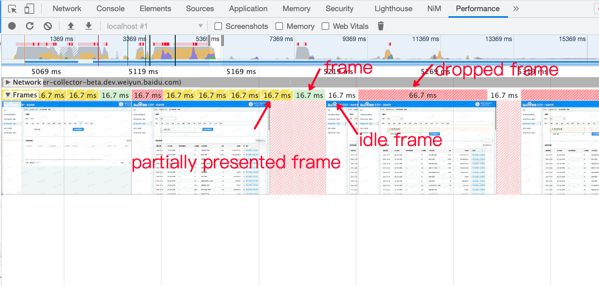

# 【草稿】浏览器一帧是什么意思

### 帧
帧的概念来自于动画，每一个画面被称为一帧，是静止的。当有很多帧(画面)连续切换时，由于人的视觉暂留形成了画面动起来的效果。通常帧数越多，画面就越流畅。反之，画面就有卡顿感。

显示器的刷新率是指显示器每秒绘制新图像的次数。单位为赫兹 (Hz)。浏览器的渲染频率FPS（Frames Per Second)跟显示器是保持一致的。

### 浏览器的一帧怎么理解
浏览器的一帧，可以理解为两个帧画面之间的时间段，即浏览器的一次渲染，通常理解为16.7ms。

### 浏览器的一次渲染是怎样的

#### 参考
[The Anatomy of a Frame](https://aerotwist.com/blog/the-anatomy-of-a-frame/)

### 浏览器 文档
https://developer.chrome.com/docs/devtools/evaluate-performance/reference/