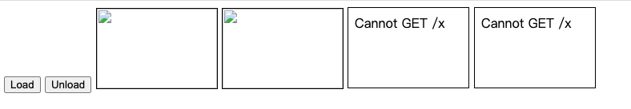
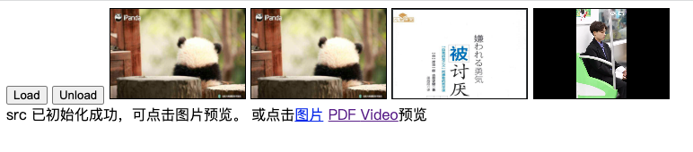
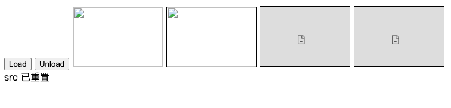

# createObjectURL and revokeObjectURL

### API介绍

[mdn URL.createObjectURL](https://developer.mozilla.org/zh-CN/docs/Web/API/URL/createObjectURL)

> URL.createObjectURL() 静态方法会创建一个 DOMString，其中包含一个表示参数中给出的对象的URL。这个 URL 的生命周期和创建它的窗口中的 document 绑定。这个新的URL 对象表示指定的 File 对象或 Blob 对象。


简单的理解一下就是将一个file或Blob类型的对象转为UTF-16的字符串，并保存在当前操作的document下。

### 使用注意
在每次调用 URL.createObjectURL() 方法时，都会创建一个新的 URL 对象。当不再需要这些 URL 对象时，每个对象必须通过调用 URL.revokeObjectURL() 方法来释放。


### demo

初始状态


点击load


点击unload


代码如下：
```html

<!DOCTYPE html>
<html lang="en">
<head>
	<meta charset="UTF-8">
	<meta name="viewport" content="width=device-width, initial-scale=1.0">
	<title>Document</title>
	<style type="text/css">
		img, iframe {
			display: inline-block;
			width: 150px;
			height: 100px;
			border: 1px solid ;
		}
	</style>
</head>
<body>
	<button id="btnLoad">Load</button>
	<button id="btnUnload">Unload</button>

	
	
	<iframe src="x" alt="" id="iframe1" ></iframe>
	<iframe src="x" alt="" id="iframe2" ></iframe>

	<div id="objUrlContent"></div>


	<script type="text/javascript">
		const getElem = (id) => {
			return document.getElementById(id)
		}
		const btnLoad = getElem('btnLoad');
		const btnUnload = getElem('btnUnload');
		const objUrlContent = getElem('objUrlContent');
		const img1 = getElem('img1');
		const img2 = getElem('img2');
		const iframe1 = getElem('iframe1');
		const iframe2 = getElem('iframe2');


		let objUrl = null;
		let pdfUrl = null;
		let videoUrl = null;

		btnLoad.addEventListener('click', async () => {
			const res = await fetch('http://172.21.217.65:1234/timg.jpeg');
			const pdfRes = await fetch('http://172.21.217.65:1234/勇气.pdf');
			const videoRes = await fetch('http://172.21.217.65:1234/vidio.mp4')

			const blob = await res.blob();
			const blobPdf = await pdfRes.blob()
			const blobVideo = await videoRes.blob()

			objUrl = URL.createObjectURL(blob);
			pdfUrl = URL.createObjectURL(blobPdf);
			videoUrl = URL.createObjectURL(blobVideo);

			img1.src = objUrl;
			img2.src = objUrl;
			iframe1.src = pdfUrl;
			iframe2.src = videoUrl;


			objUrlContent.innerHTML = `src 已初始化成功，可点击图片预览。 或点击<a href=${objUrl} target='_'>图片</a> <a href=${pdfUrl} target='_'>PDF </a> <a href=${videoUrl} target='_'>Video</a>预览`
		})

		btnUnload.addEventListener('click', e => {
			// 撤销对象资源。
			URL.revokeObjectURL(objUrl);
			URL.revokeObjectURL(pdfUrl);
			URL.revokeObjectURL(videoUrl);
			img1.src = objUrl;
			img2.src = objUrl;
			iframe1.src = pdfUrl;
			iframe2.src = videoUrl;
			objUrlContent.innerText = 'src 已重置';
		})

	</script>
</body>
</html>

```

#### 参考
https://www.youtube.com/watch?v=18q6-QR_XXY