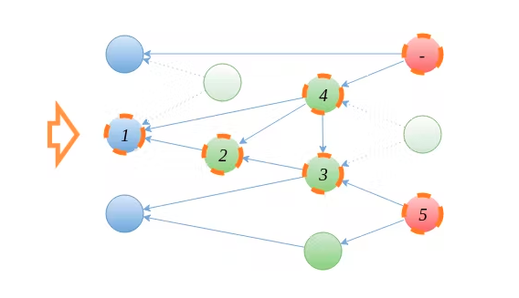

# 【译文】Mobx背后的基本原则

mobx中文文档在Mobx主旨一章中，引用了本文。[原文](https://hackernoon.com/the-fundamental-principles-behind-mobx-7a725f71f3e8) 发布于2017.1.11

----

几周前Bertalan Miklos写了一篇非常有趣的博客，他在其中比较了基于代理的nx框架和MobX。这个博客之所以有趣，不仅是因为它证明了代理的可行性，更重要的是它触及了MobX和透明反应(自动反应)的一些基本概念。到目前为止，我可能还没有详细说明这些概念。所以让我来分享MobX的一些独特功能背后的思维模式。

### 为什么MobX同步运行所有派生 Why MobX runs all derivations synchronously
本文涉及到MobX的一个非常显著的特性：在MobX中，所有派生都是同步运行的。这很不寻常。大多数UI框架不这样做(如果有的话)。(像RxJS这样的响应式流库在默认情况下也是同步运行的，但是它们缺乏透明的跟踪，所以情况不能完全比较)。

在开始MobX之前，我做了大量关于开发者如何看待现有库的研究。Meteor、Knockout、Angular、Ember和Vue等框架都暴露了类似MobX的反应性行为。它们已经存在很长时间了。所以我为什么要创造MobX？在深入研究那些对这些库不满意的人们的问题和评论时，我想到了一个反复出现的主题，它导致了反应性的承诺和在实践中必须处理的棘手问题之间的鸿沟。

_这个反复出现的主题是“可预测性”。如果一个框架运行你的代码两次，或者有延迟，就很难调试它。或者进行推理。即使是像承诺这样的“简单”抽象，由于它们的异步特性，也很难调试。_

我相信不可预测性是Flux模式(尤其是Redux)流行的最重要原因之一：它恰恰解决了扩展时的可预测性问题。工作中没有神奇的调度程序。

然而MobX采取了另一种方法；它没有抛弃自动跟踪和运行功能的整个概念，而是试图解决根本原因。所以我们仍然可以从这个模式中获益。透明反应是说明性的、高级的和简洁的。它通过添加两个约束来做到这一点：
1. 确保对于任何给定的突变集，任何受影响的派生都将准确地运行一次。
2. 派生是从来没有过期，而且它们的效果对任何观察者都是立即可见的。
第一个约束：解决所谓的“双管齐下”。它确保如果一个派生值依赖于另一个派生值，这些派生值将以正确的顺序运行。这样他们就不会不小心读到过期的值。这究竟是如何工作的，在之前的一篇博文中有详细的描述。

第二个约束：派生永远不会过时；更有趣。它不仅防止了所谓的“故障”(暂时的不一致)。它需要一种完全不同的方法来调度派生。

_到目前为止，当涉及到调度派生时，UI库总是采取简单的方法：将派生标记为脏的，并在下一个标记中在所有状态更新后重新运行它们。_

这是简单而直接的。如果您只关心更新DOM，那么这是一种很好的方法。DOM通常有点“滞后”，我们几乎不通过编程从它读取数据。所以暂时的陈旧不是真正的问题。然而，暂时性的陈旧扼杀了反应式库的普遍适用性。以下代码片段为例：
```jsx

const user = observable({
  firstName: “Michel”,
  lastName: “Weststrate”,
  // MobX computed attribute
  fullName: computed(function() {
    return this.firstName + " " + this.lastName
  })
})

user.lastName = 'Vaillant'

sendLetterToUser(user)

```

现在有趣的问题是：当`sendLetterToUser(user)`运行时，它看到的是用户全名的更新版本还是过时版本？当使用MobX时，答案总是“更新”：因为MobX保证任何派生都同步更新。这不仅防止了许多令人讨厌的意外，而且还使调试变得简单得多，因为派生总是在其堆栈中有导致的突变。

因此，如果您想知道为什么一个派生正在运行，只需向上遍历堆栈就可以回到导致派生无效的操作。如果MobX使用派生的异步调度/处理，这些优势就会丧失。这个库不会像它所知道的那样普遍适用。

当我开始使用MobX时，有很多人怀疑这是否能足够有效地完成：对派生树进行排序，并对每个突变运行派生。

_但现在我们有了一个开箱即用的系统，它通常比手动优化的代码更高效，如这里和这里所报告的例子。_

### 事务和行为 (Transactions & Actions)
是的，要付出一点回报；突变应该在事务中分组，以原子地处理多个更改。事务将派生的执行推迟到事务结束，但仍然同步地运行它们。更酷的；如果您在事务结束之前使用计算值，那么MobX将确保您获得该派生的更新值!

在实践中，没有人显式地使用事务，它们甚至在MobX 3中被弃用。因为操作自动应用事务。动作在概念上要好得多；动作指示更新状态的函数。它们是响应状态更新的相反的反应。


### 计算值和反应 (Computed values and reactions)
MobX着重关注的另一件事是分离可以派生的值(计算值)和在状态改变时应自动触发的副作用(反应)。这些概念的分离对于MobX来说非常重要和基础。

例子推导图。可观察状态(蓝色)，计算值(绿色)和反应(红色)。如果没有被反应(间接)观察到，计算值将暂停(浅绿色)。MobX确保每个派生只运行一次，并且在突变之后以最优顺序运行。

计算值应该总是优先于反应。

有几个原因：

它们提供了很多概念上的清晰。计算值应该总是完全用其他可观察值来表示。这就产生了一个清晰的计算推导图，而不是一个不清楚的相互触发的反应链。
换句话说，触发更多反应的反应或更新状态的反应：它们都被认为是MobX中的反模式。连锁反应会导致难以跟踪的连锁事件，应该避免。
对于计算值，MobX可以确定它们是否在某个地方被使用。这意味着计算值可以自动挂起和垃圾回收。这节省了大量的样板文件，并对性能产生了显著的积极影响。
计算值必须是无副作用的。因为计算值不允许有副作用，所以MobX可以安全地对计算值的执行顺序进行重新排序，以确保重新运行的次数最少。如果没有观察到计算，它可以决定只懒惰地运行计算。
自动缓存计算值。这意味着，只要相关的可观察对象没有发生变化，读取计算值就不会重新运行计算。
最后，每个软件系统都需要副作用。原因很简单，我们总是需要从响应式代码过渡到命令式代码。例如，发送网络请求或刷新DOM。然而，这些反应通常可以放在像React观察者组件这样的干净抽象中。

因此，MobX竭尽全力确保永远不会观察到过时的值，派生操作不会比预期的更频繁地运行。事实上，如果没有人积极观察，计算甚至根本不会运行。在实践中，这是至关重要的。最初对MobX通常会有一些阻力，因为这些概念会让人们想起MVVM框架不可预测的行为。然而，我认为操作、计算值和反应的语义清晰性、不能观察到陈旧值的事实、所有派生都运行在与导致操作相同的堆栈上的事实，都是这里所有不同之处。


### 代理和MobX (Proxies & MobX)
MobX在生产中大量使用，因此承诺在每个ES5环境中运行。这使得使用MobX可以针对实际的任何浏览器，但同时也使得目前依赖代理是不可接受的。因此，MobX有一些缺点，比如不完全支持expando属性和使用伪数组。计划总是最终转移到基于代理的实现，这已经不是秘密了。MobX 3已经为使用代理做了一些准备，第一个基于代理的可选特性很快就会出现。然而，在绝大多数设备和浏览器支持Proxy之前，核心将保持Proxy免费。

### 浅数据结构的例子 (The case for shallow data structures)
无论将来是否迁移到代理，修饰符/浅层可观察概念都将以某种形式保留在MobX中。

修改机制的原因不是性能；它是互操作性。

只要应用程序状态中的所有数据都在您的控制之下，自动可观察性就非常方便。MobX就是这样开始的。但在某个时刻，你会发现这个世界并不像你希望的那样理想。在每个应用程序中都有许多库，每个库都扮演着自己的角色，并做出自己的假设。MobX中引入了修饰符和浅集合，以明确允许MobX管理哪些数据。

例如，有时需要存储对外部概念的引用。然而，对于已经由一些外部库管理的对象(例如JSX或DOM元素)，自动转换为可观察对象通常是不可取的。它很容易干扰该库的内部假设。人们可以在MobX问题跟踪器中发现相当多的问题，将对象无意地转换为可观察对象会导致意外的行为。修饰语并不是为了暗示“请加快速度”，而是暗示“只观察对对象的引用，将对象本身视为一个黑匣子，因为它不在我们的控制之下”。

这个概念也非常适合处理不可变数据结构。例如，它使创建消息的可观察映射成为可能，其中消息本身被认为是不可变的数据结构。

第二个问题是，自动观察集合总是创建“克隆”，这并不总是可以接受的。代理总是产生一个新的对象，而且它们只在“一个方向”上工作。因此，如果代理对象的初始值被最初分发它的库修改了，代理将不会检测到该更改。说明：

```jsx
const target = { x: 3 }
const proxy = createObservableProxy(target)

observe(() => {console.log(proxy.x)})

target.x = 4 // proxy.x is now 4, but no log statement will be written, as the proxy setter hook is not fired!
```

修饰符为处理这些情况提供了必要的灵活性。目前，由于MobX使用属性描述符，它实际上可以增强现有对象，因此如果确实需要，数据突变可以在两个方向上工作。

也就是说，NX在读取过程中动态生成可观察代理的方式非常有趣。我不确定它是如何处理参考透明度的，但到目前为止，这似乎是一件非常聪明的事情。通过读/写$raw来避免修饰符是一个非常有趣的方法。我不确定它是读还是写更干净，但它肯定省去了一些概念的引入，比如shallow，这很好。

### untracked做了什么？ (What does untracked do?)
需要注意的是untracked的语义，不像建议的那样，它与NX中的$raw更新无关。在MobX中，没有办法在不通知观察者的情况下更新数据。允许这样做会有意地在应用程序中引入过时数据的可能性。这违背了MobX的原则。人们有时认为他们需要这样一种机制，但我从未遇到过一个现实生活中的用例中没有概念上更清晰的解决方案。

untracked的工作方式正好相反：它不是关于无法检测到的写入。相反，它只会导致读取不被跟踪。换句话说，这是在说，我们对我们使用的数据未来的任何更新都不感兴趣。与事务一样，没有人在实践中使用这个API，但它是一个嵌入到操作中的机制，因为它在概念上非常有意义：操作在响应(用户)事件时运行，而不是响应状态更改，因此它们不应该跟踪它们使用的数据。这就是反应的作用。

### Conclusion

MobX被设计成一个普遍适用的反应性库。它不仅仅是一个在适当的时候重新渲染UI的工具。

相反，它将高效工作(在性能和努力方面)的概念推广到仅仅是一些其他数据的项目的数据。例如，在Mendix中，MobX也被用于后端流程。同步运行派生以及计算值和反应之间的分离是MobX的基础。它使我们对应用程序状态有了更清晰的认识。

最后，nx-observe证明了代理是透明响应式编程库非常可行的基础。无论是概念上还是性能上。

