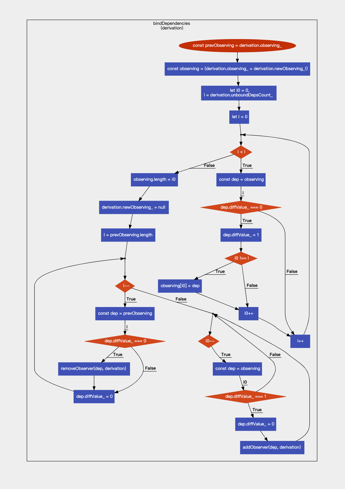

# 【源码】Mobx Derivation bindDependencies

`bindDependencies`是derivation的一个内部方法，供`trackDerivedFunction`方法使用。

### 主要功能
通过对比挂在derivation对象上的新旧依赖，完成derivation对象的依赖更新。
`bindDependencies`还更新了其观察者的状态，本次先不讨论。

### 主要思路
1. prevObserving保存旧依赖derivation.observing_
2. observing 和 derivation.observing_同时更新成新依赖
3. 通过遍历observing处理新依赖
   1. 若依赖项的diffValue_为0
      1. 则将其置为1
      2. 对比 i与i0，若不同，则将observing[i0]置为当前依赖项dep
      3. i 与 i0 同时增1。
   2. 若依赖项的diffValue_为1，
      1. 则说明此依赖已记录，不再处理
      2. 仅增1， i0不变（i0的数值为遍历过程中新依赖去重后的依赖数量）
4. observing.length置为i0（此时observing为去重后的新依赖）
5. derivation.newObserving_置为null (newObserving_不需要外部追踪，详见[#614](https://github.com/mobxjs/mobx/issues/614))
6. 遍历旧依赖prevObserving
   1. 若依赖项的diffValue_为0
      1. 则此依赖项仅在旧依赖中使用，已过期，将其移除removeObserver
   2. 若依赖项的diffValue_为1，
      1. 则此依赖在新旧依赖中均使用，
      2. 将依赖项的diffValue_置为0（只有新旧依赖都使用的依赖diffValue_值为0）
7. 再次遍历新依赖observing
   1. 若依赖项的diffValue_为0
      1. 则此依赖在新旧依赖中均使用，已添加，不处理
   2. 若依赖项的diffValue_为1，
      1. 则此依赖项仅在新依赖中使用，
      2. 将依赖项的diffValue_置为0
      3. 需添加到依赖列表

### 重点看一下三次对依赖列表的遍历

步骤3通过遍历observing新依赖主要任务：
1. 为依赖项打标记，凡是新依赖，其diffValue_都置为1（diffValue_为1，在步骤6有用）
2. 为新依赖去重，通过i和i0对比实现

步骤6通过遍历prevObserving旧依赖主要任务：
1. 移除不再需要的依赖
2. 为依赖项打标记，凡是新依赖中也使用的依赖，其diffValue_都置为0（diffValue_为0，在步骤7有用）

步骤7再次遍历observing新依赖主要任务：
1. 添加依赖
2. 统一依赖项diffValue_值，都置为0

### code
下面是 mobx V6.0.2版本bindDependencies代码实现及部分功能块注释说明。

```js

/**
 *
 * diffs newObserving with observing.
 * update observing to be newObserving with unique observables
 * notify observers that become observed/unobserved
 */
function bindDependencies(derivation: IDerivation) {

    const prevObserving = derivation.observing_
    const observing = (derivation.observing_ = derivation.newObserving_!) // observing 保存新观察对象
    let lowestNewObservingDerivationState = IDerivationState_.UP_TO_DATE_

    // Go through all new observables and check diffValue: (this list can contain duplicates):
    //   0: first occurrence, change to 1 and keep it
    //   1: extra occurrence, drop it
    let i0 = 0,
        l = derivation.unboundDepsCount_ // 未绑定的依赖 数量  === newObserving_ .length

    // 新依赖处理
    // [a b b c d] -> [a b c d d]
    for (let i = 0; i < l; i++) {
        const dep = observing[i]

        if (dep.diffValue_ === 0) {
            dep.diffValue_ = 1

            if (i0 !== i) {
                observing[i0] = dep // 新依赖中如果有重复的项，后面的项目 补到前面的位置。做了
            }

            i0++
        }

        // Upcast is 'safe' here, because if dep is IObservable, `dependenciesState` will be undefined,
        // not hitting the condition
        if (((dep as any) as IDerivation).dependenciesState_ > lowestNewObservingDerivationState) {
            lowestNewObservingDerivationState = ((dep as any) as IDerivation).dependenciesState_
        }
    }


    observing.length = i0

    derivation.newObserving_ = null // newObserving shouldn't be needed outside tracking (statement moved down to work around FF bug, see #614)

    // Go through all old observables and check diffValue: (it is unique after last bindDependencies)
    //   0: it's not in new observables, unobserve it
    //   1: it keeps being observed, don't want to notify it. change to 0
    l = prevObserving.length
    // 旧依赖遍历
    while (l--) {
        const dep = prevObserving[l]
        if (dep.diffValue_ === 0) { // 如果新依赖中用到 diffValue 应该是1
            removeObserver(dep, derivation) // 这里只删除新依赖中没有的依赖
        }
        dep.diffValue_ = 0 // 把新旧依赖中都用到依赖 diffValue 改成0
    }

    // Go through all new observables and check diffValue: (now it should be unique)
    //   0: it was set to 0 in last loop. don't need to do anything.
    //   1: it wasn't observed, let's observe it. set back to 0
    while (i0--) { // i0 标记的位置 应该是 新依赖的最后的位置
        const dep = observing[i0]
        if (dep.diffValue_ === 1) { // 只有新依赖中用到 diffValue 应该是1
            dep.diffValue_ = 0
            addObserver(dep, derivation) // 只有新依赖中没有的依赖才执行添加操作
        }
    }

    // Some new observed derivations may become stale during this derivation computation
    // so they have had no chance to propagate staleness (#916)
    if (lowestNewObservingDerivationState !== IDerivationState_.UP_TO_DATE_) {
        derivation.dependenciesState_ = lowestNewObservingDerivationState
        derivation.onBecomeStale_()
    }
}

```
### 流程图
代码执行图，由code2flow生成，蛮有意思的。


### 参考
https://juejin.cn/post/7078956617206611982#heading-3

### 疑问
本质上来看，`bindDependencies`方法实现了新旧依赖两个数组的diff，去掉不需要的依赖，去掉重复依赖。
代码实现上是否过于复杂了?但是，这个实现方式，确实实现了O(n)的复杂度。

再仔细想一下，新旧依赖数组一直被保存在两个变量中，居然从未相遇过。在数组去重和diff上很少见了。

通过一个变量来标记是否新旧，以后我也能写出O(n)的数组去重和diff了。

今天就到这吧。继续加油！💪🏻